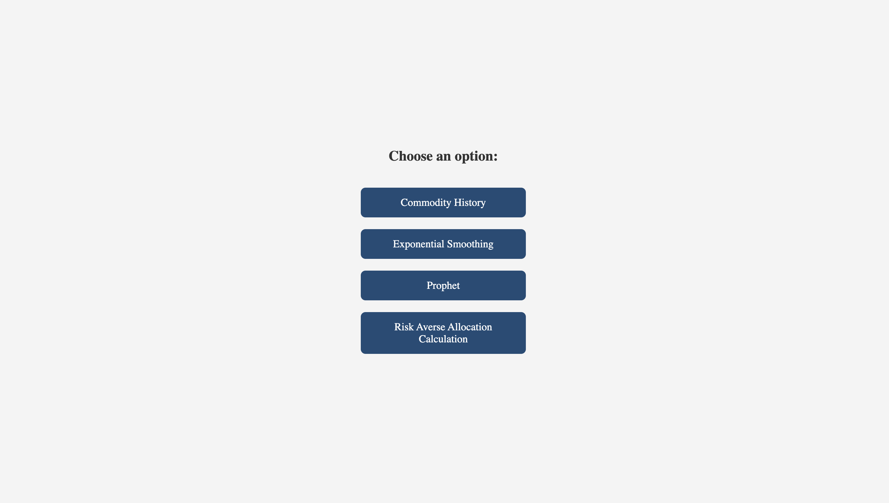
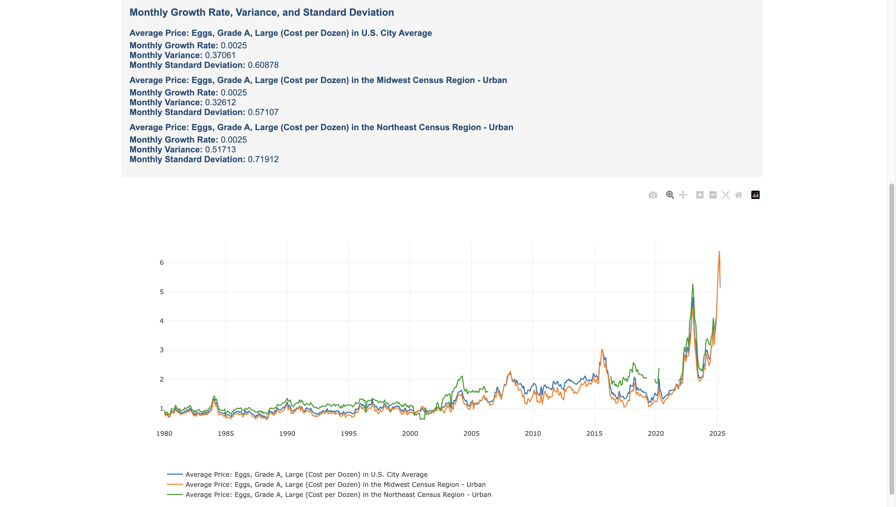
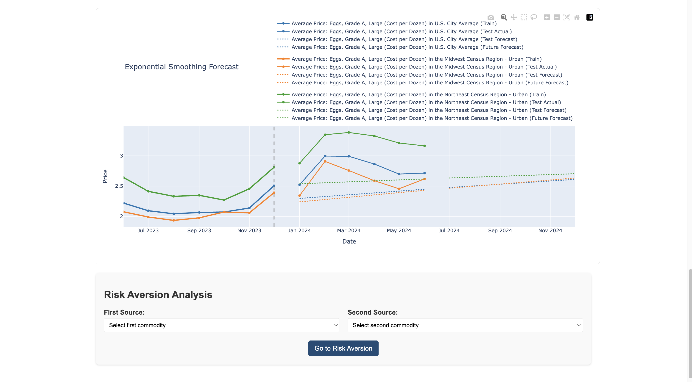
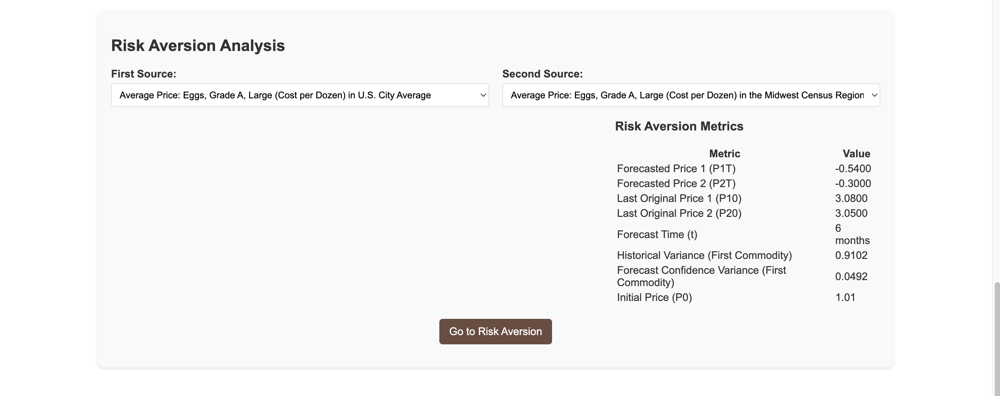
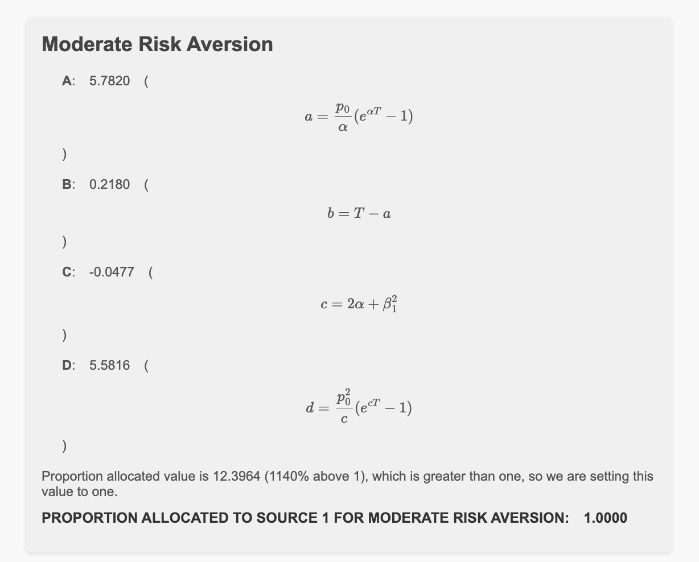

# Commodity Forecasting Web App: Price Analysis, Forecasting, and Risk Aversion

  
*Commodity forecasting web app home page, built by Chandrakanth Naidu Gonuguntla.*

## Overview

Developed by **Chandrakanth Naidu Gonuguntla** as a graduate research assistant at Clarkson University under **Prof. Santosh Mahapatra**, this **Flask web app** uses the **FRED API** for **commodity price analysis**, **forecasting**, and **risk aversion**. It features **Exponential Smoothing** and **Prophet** for price predictions and optimizes contract allocations. Currently available for Clarkson University’s Business Department, it will be public soon.

**[Watch the Demo Video]** *[[YouTube](https://youtu.be/PyU6ZZPpO2M?si=20HKbhlR0Cof6CDz)]* | **[User Guide](user_guide.md)**

## Features

- **Commodity Price Analysis**: Visualize historical trends with **Plotly graphs** and export as Excel.  
    
  *Historical commodity price graph, alt: Interactive Plotly graph for commodity analysis.*

- **Exponential Smoothing Forecasting**: Predict prices with customizable parameters, showing training, test, and forecast data.  
    
  *Exponential Smoothing forecast, alt: Forecast graph with dotted lines for predictions.*

- **Prophet Forecasting**: Advanced forecasts with confidence intervals and metrics (MAE, RMSE).  
    
  *Prophet forecast, alt: Forecast graph with confidence intervals.*

- **Risk Aversion Analysis**: Optimize contract allocations for moderate/high risk preferences.  
    
  *Risk aversion results, alt: Moderate risk aversion allocation output.*

## Demo Walkthrough

The demo video ([[YouTube](https://youtu.be/PyU6ZZPpO2M?si=20HKbhlR0Cof6CDz)]) showcases the flow:
1. **Home Page**: Navigate to analysis options.
2. **Commodity History**: Select “Oil,” three titles, view graph, and download data.
3. **Exponential Smoothing**:
   - Choose “Oil,” titles, and dates.
   - Set parameters and view forecast graph (training, test, dotted forecast lines).
   - Export results and navigate to risk aversion.
4. **Risk Aversion**: Input parameters, calculate allocations, and download PDF.
5. **Prophet**: Repeat with Prophet’s settings and confidence intervals.

See the [User Guide](user_guide.md) for detailed steps.

## Tech Stack

- **Backend**: Flask, Python, FRED API, pandas, numpy, statsmodels, prophet, openpyxl
- **Frontend**: HTML, CSS, JavaScript, Plotly, jsPDF, html2canvas, jQuery
- **Environment**: Python 3.8+, virtualenv

## Folder Structure

```
commodity_forecasting_project/
├── app.py
├── static/
│   └── fred_expo_styling.css
├── templates/
│   ├── fred_commodity_history.html
│   ├── fred_exponential_forecast.html
│   ├── fred_prophet_forecast.html
│   ├── home.html
│   └── riskaversion.html
├── requirements.txt
├── .env
├── docs/
│   └── user_guide.md
└── images/
    ├── home.png
    ├── cpa_graph.png
    ├── esf_graph.png
    ├── prophet_graph.png
    ├── pcp_mra.png
    ├── code_snippet.png
```

## Setup Instructions

1. **Clone**:
   ```bash
   git clone https://github.com/chandrakanthnaidu/commodity-forecasting-project.git
   cd commodity-forecasting-project
   ```

2. **Virtual Environment**:
   ```bash
   python -m venv venv
   source venv/bin/activate  # Linux/macOS
   venv\Scripts\activate     # Windows
   ```

3. **Install Dependencies**:
   ```bash
   pip install -r requirements.txt
   ```

4. **Configure**:
   - Add `.env` with:
     ```
     FRED_API_KEY=your_api_key_here
     ```
   - Get a key from [fred.stlouisfed.org](https://fred.stlouisfed.org/).

5. **Run**:
   ```bash
   python app.py
   ```
   - Access: `http://localhost:5000`.

## Usage

Follow the [User Guide](user_guide.md) to analyze prices, forecast trends, and calculate risk allocations.

## Code Example  
*Flask route for forecasting, alt: Python code for Exponential Smoothing.*

```python
@app.route('/run_exponential_forecast', methods=['POST'])
def run_exponential_forecast():
    data = request.json
    results = run_exponential_model(data)
    return jsonify({'success': True, 'results': results, 'plot': generate_plot_json(results)})
```


## Connect

- **LinkedIn**: [www.linkedin.com/in/chandrakanthnaidu](www.linkedin.com/in/chandrakanthnaidu)
- **Portfolio**: [https://chandrakanthnaidu.github.io/](https://chandrakanthnaidu.github.io/)
- **Instagram**: [https://www.instagram.com/ckn_gonuguntla/](https://www.instagram.com/ckn_gonuguntla/)
- **Facebook**: [https://www.facebook.com/chandrakanthnaiduG/](https://www.facebook.com/chandrakanthnaiduG/)

**Acknowledgments**: Prof. Santosh Mahapatra and the FRED API.

#CommodityForecasting #DataScience #Python #WebDevelopment
