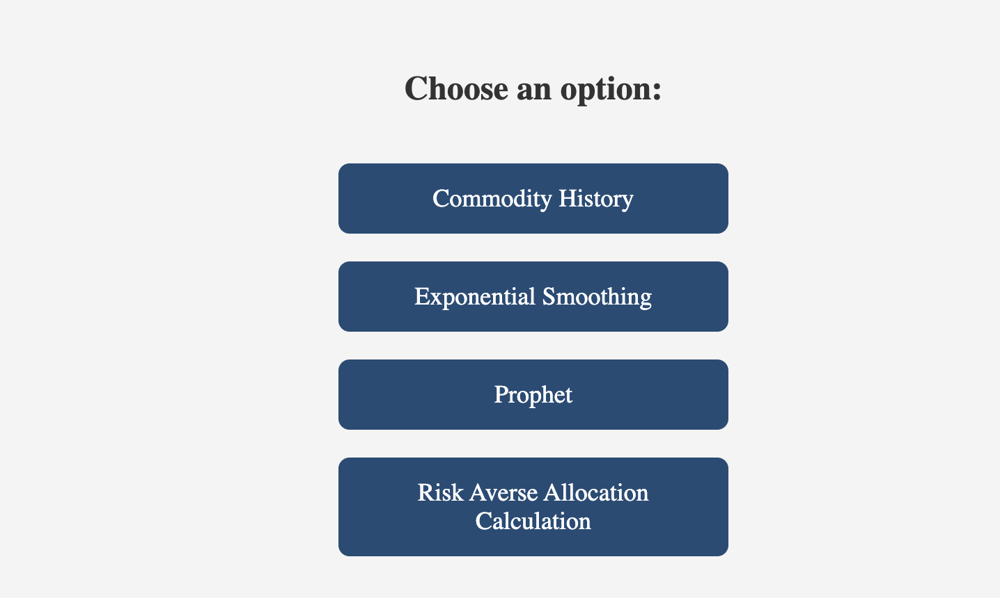
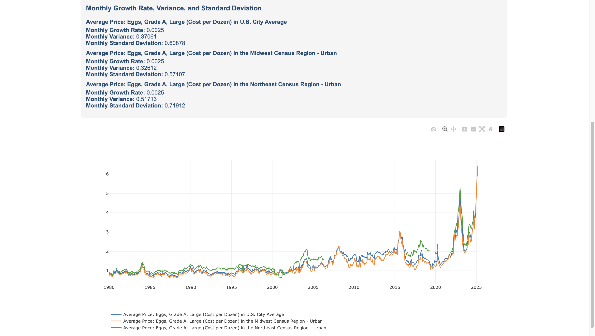
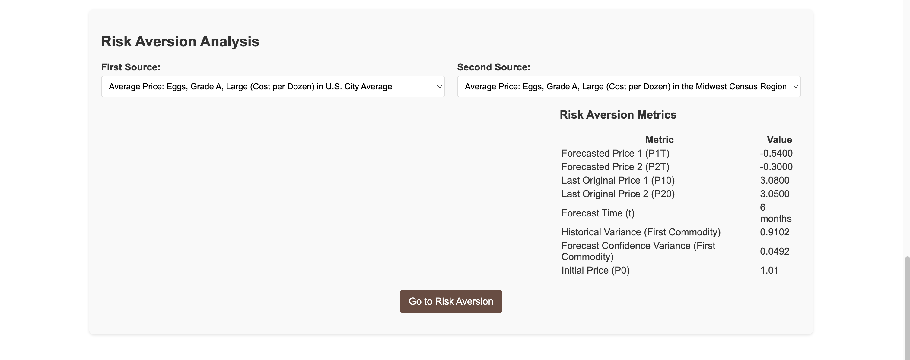
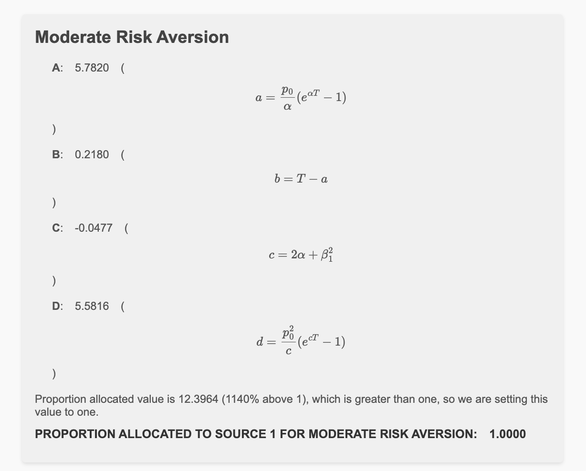

# User Guide: Commodity Forecasting Web App for Price Analysis and Risk Aversion

Hi, I’m **Chandrakanth Naidu Gonuguntla**, a graduate research assistant at Clarkson University. I built the **Commodity History, Forecasting, and Risk Aversion Analysis Application** under **Prof. Santosh Mahapatra**, using the **FRED API** to empower **commodity price forecasting** and **risk analysis**. This guide, optimized for new users, explains how to use this **Flask web app**, mirroring my demo video ([Insert YouTube Link]). Currently available for Clarkson University’s Business Department, it will be public soon.

## What’s This App?

This **web application** helps you:
- **Analyze Commodity Prices**: Visualize historical trends with **Plotly**.
- **Forecast Prices**: Use **Exponential Smoothing** and **Prophet** for predictions.
- **Optimize Contracts**: Calculate **risk aversion** allocations.

I developed the **Python** backend and **JavaScript** frontend to ensure a user-friendly experience. Let’s explore!

## Getting Started

1. **Access**: Run locally (`http://localhost:5000`) per the [GitHub README](https://github.com/chandrakanthnaidu/commodity-forecasting-project).
2. **Requirements**: Python 3.8+, FRED API key ([fred.stlouisfed.org](https://fred.stlouisfed.org/)).

## User Flow

### 1. Home Page
Start at `home.html`:  
  
*Home page, alt: Commodity forecasting app navigation.*

- Choose **Commodity History**, **Exponential Smoothing**, or **Prophet Forecasting**.

### 2. Commodity Price Analysis
- **Select Commodity**: E.g., “Oil.”
- **Choose Titles**: Select three regions.
- **View Graph**: See historical prices.  
    
  *Historical prices, alt: Plotly graph for commodity analysis.*
- **Filter Dates**: Narrow the range.
- **Download**: Excel or PNG.

### 3. Exponential Smoothing Forecasting
- **Select**: “Oil,” three titles, training dates.
- **Parameters**: Trend, seasonality, smoothing levels.  
    
  *Parameter input, alt: Exponential Smoothing settings.*
- **Run**: View graph (training left, test and forecast right of dotted line).  
    
  *Forecast, alt: Exponential Smoothing graph with dotted lines.*
- **Download**: PDF, Excel.
- **Risk Aversion**: Select two titles and click to proceed.

### 4. Prophet Forecasting
- **Select**: Same as Exponential Smoothing.
- **Parameters**: Growth, changepoint scale.
- **Run**: View graph with confidence intervals.  
    
  *Prophet forecast, alt: Forecast with confidence intervals.*
- **Download**: PDF, Excel.
- **Risk Aversion**: Repeat as above.

### 5. Risk Aversion Analysis
- **Input**: Variance, contract duration.  
    
  *Risk parameters, alt: Risk aversion input.*
- **Calculate**: Moderate/high risk allocations.  
    
  *Results, alt: Moderate risk aversion output.*
- **Download**: PDF.

## Tips
- Check data availability in FRED.
- Watch the demo ([Insert YouTube Link]).
- Explore the [GitHub repo](https://github.com/chandrakanthnaidu).

## My Role
I built the backend (**Flask**, **Python**) and frontend (**HTML**, **JavaScript**), overcoming challenges like data formatting and error handling.

## Connect
- **LinkedIn**: [www.linkedin.com/in/chandrakanthnaidu](www.linkedin.com/in/chandrakanthnaidu)
- **Portfolio**: [https://chandrakanthnaidu.github.io/](https://chandrakanthnaidu.github.io/)
- **Instagram**: [https://www.instagram.com/ckn_gonuguntla/](https://www.instagram.com/ckn_gonuguntla/)
- **Facebook**: [https://www.facebook.com/chandrakanthnaiduG/](https://www.facebook.com/chandrakanthnaiduG/)

**Acknowledgments**: Prof. Santosh Mahapatra and FRED API.

#CommodityForecasting #DataScience #Python #WebDevelopment
